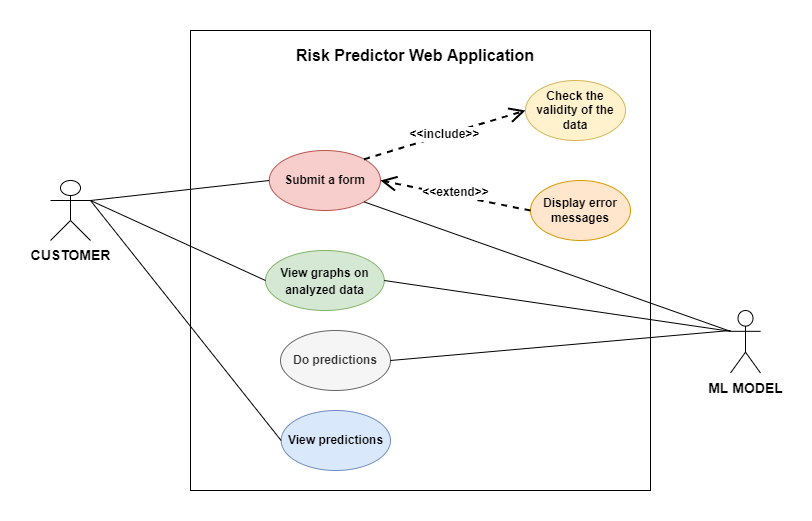

___
# Prediction of Risks Associated with Mass Corona Vaccination
___

## Introduction

There is a trend among people not to get COVID-19 vaccinations. Because of the differing viewpoints of the various parties involved, society is skeptical of obtaining it. However, there is no research being done into the vaccination's side effects or the causes of illnesses and deaths. This project will look into the specific criteria or risks that come with vaccinations. So, this will help people to get an idea to check whether to take the vaccines or not. 

## Problem 

Society is doubtful of getting COVID-19 vaccines due to spreading opinions,  various myths, and fear of getting side effects.
the above-mentioned problem. (what are their fears about getting the vaccine, 
Problem diagnosis: a small survey can be conducted, to get a clear idea about etc..)

## Solution

To predict the risks associated with mass corona vaccination we are going to analyze the no of deaths, hospitalizations, and side effects(blood clotting, kidney disease, lung disease, heart disease, Parkinson's disease, etc) after the first dose, second dose or after booster dose with the following parameters.
- age group
- gender
- blood group
- self-reported comorbidities (eg:  diabetes, kidney disease, lung disease, heart disease…..)
- height and weight (BMI)
- vaccine type
- district 
- affected with COVID-19 before?

During the above analysis process first, we will try out different machine learning models, and then we will choose the best model by 
comparing the accuracy of each model.

Finally, a web application that is combined with the best machine learning model will be developed. 
	
Application features and description of the web application
1. Taking an information form from a person who is willing to take a vaccine and predict the risks (side effects) that can occur according to the developed model. 
	That form contains the following information.
- age group
- gender
- blood group
- self-reported comorbidities (eg:  diabetes, kidney disease, lung disease, heart disease…..)
- height and weight (BMI)
- vaccine type
- district 
- affected with COVID-19 before?

2. Graphical representation of the analyzed data.
	
### Use case diagram

  </img> 

## Team Members
1. E/17/040 Chandrasena M.M.D [[e17040@eng.pdn.ac.lk](mailto:e17040@eng.pdn.ac.lk)]
2. E/17/356 Upekha H.P.S [[e17356@eng.pdn.ac.lk](mailto:e17356@eng.pdn.ac.lk)]
3. E/17/407 Wijesooriya H.D [[e17407@eng.pdn.ac.lk](mailto:e17407@eng.pdn.ac.lk)]

## Links

1. [Project page](https://cepdnaclk.github.io/e17-co328-Prediction-of-risks-associated-with-mass-corona-vaccination/ )
2. [Github repo](https://github.com/cepdnaclk/e17-co328-Prediction-of-risks-associated-with-mass-corona-vaccination)
3. [Department of computer engineering](http://www.ce.pdn.ac.lk/)

